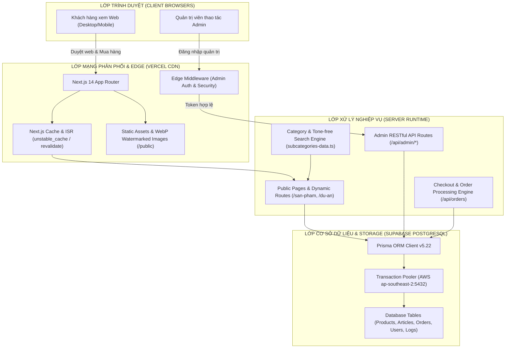
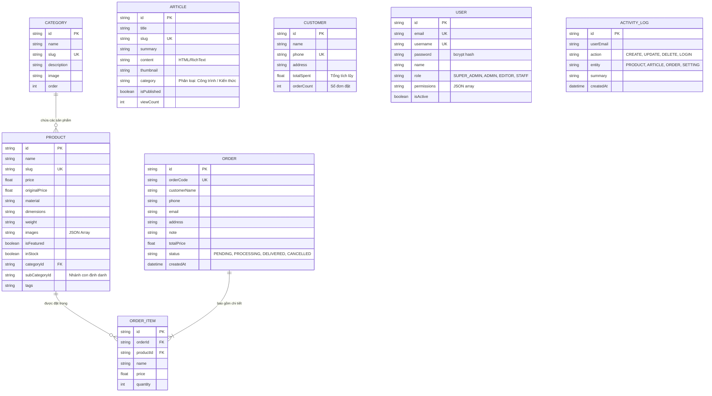
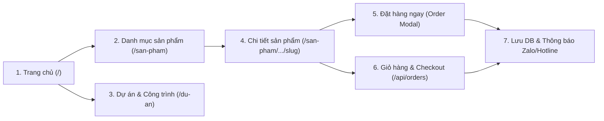
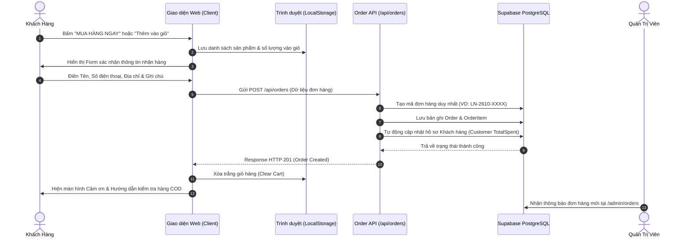
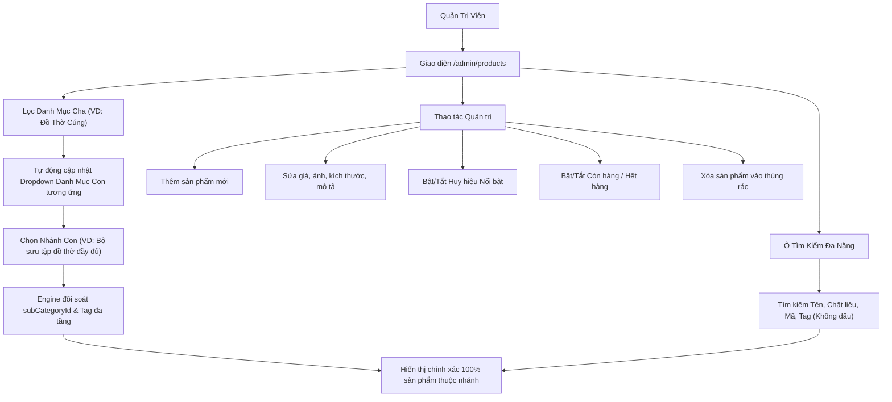
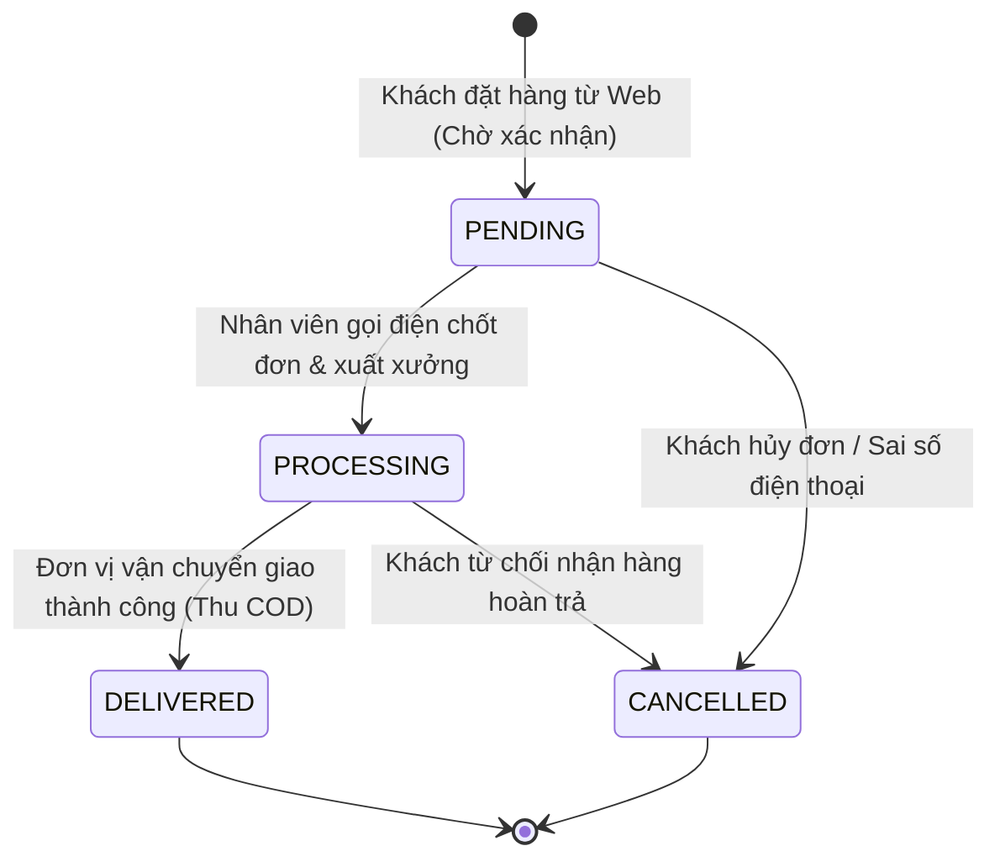

# TÀI LIỆU KỸ THUẬT & BÁO CÁO LUỒNG HOẠT ĐỘNG HỆ THỐNG
## WEBSITE THƯƠNG MẠI ĐIỆN TỬ & GIỚI THIỆU CÔNG TRÌNH: ĐỒ ĐỒNG LỘC NAM
**Tên miền chính:** [quatanglocnam.com](https://www.quatanglocnam.com)  
**Môi trường:** Production (Vercel Edge Platform & Supabase PostgreSQL)  
**Tài liệu dành cho:** Đội ngũ Quản trị viên, Lập trình viên tiếp nhận (Developers), Nhân sự Kiểm thử (QA/QC) và Ban Giám Đốc.

---

## 1. TỔNG QUAN KIẾN TRÚC HỆ THỐNG (SYSTEM ARCHITECTURE)

Hệ thống được phát triển theo mô hình kiến trúc **Full-stack Jamstack Hiện đại** (Modern Web Architecture) tối ưu hóa tốc độ tải trang, chuẩn SEO Google và bảo mật cấp doanh nghiệp.

### Các công nghệ cốt lõi cấu thành:
1. **Frontend & SSR Framework:** [Next.js 14 (App Router)](file:///c:/Users/Admin/Downloads/Web%20b%C3%A1n%20%C4%91%E1%BB%93%20%C4%91%E1%BB%93ng/package.json#L20) với React 18, TypeScript 5.7, TailwindCSS 3.4.
2. **Database & ORM:** PostgreSQL trên Supabase Pooler qua [Prisma ORM](file:///c:/Users/Admin/Downloads/Web%20b%C3%A1n%20%C4%91%E1%BB%93%20%C4%91%E1%BB%93ng/prisma/schema.prisma#L1-L10).
3. **Bảo mật:** JWT (JSON Web Token) cho phiên làm việc Admin, bcryptjs mã hóa mật khẩu, [Middleware](file:///c:/Users/Admin/Downloads/Web%20b%C3%A1n%20%C4%91%E1%BB%93%20%C4%91%E1%BB%93ng/middleware.ts#L1-L22) chặn truy cập trái phép.
4. **Hiệu năng & Tải ảnh:** Sharp Image Processing, cơ chế đóng dấu bản quyền URL động `getWatermarkedImageUrl()`, fallback ảnh chống vỡ khung hình `onError`.

---

## 2. SƠ ĐỒ THỰC THỂ CƠ SỞ DỮ LIỆU (DATABASE ERD)

Toàn bộ dữ liệu được quản lý đồng nhất trong PostgreSQL, liên kết chặt chẽ giữa danh mục, sản phẩm, bài viết công trình, đơn hàng và khách hàng:

> [!IMPORTANT]
> **Điểm mấu chốt về dữ liệu (Sản phẩm vs. Công trình):**
> * **Bảng `Product` (622 sản phẩm):** Dành riêng cho hàng hóa bán lẻ tiêu chuẩn có thể đặt mua (Tượng đồng, Đồ thờ cúng, Tranh đồng, Trống đồng, Quà tặng mạ vàng).
> * **Bảng `Article` (Dự án & Tin tức):** Nơi lưu trữ các công trình đúc chuông nhà chùa (đúc đại hồng chung tại chân chùa, tượng Phật công cộng nặng hàng tấn...). Các mục này là hồ sơ năng lực dự án, không hiển thị giỏ hàng bán lẻ.

---

## 3. CHI TIẾT LUỒNG HOẠT ĐỘNG TRANG KHÁCH HÀNG (STOREFRONT)

### 3.1. Luồng Người Dùng & Các Trang Chính

### 3.2. Chức Năng Trang Sản Phẩm (`/san-pham` & `/san-pham/[category]`)
* **Bộ lọc danh mục đa tầng:** 
  - Khách hàng có thể lọc theo Danh mục lớn (*Đồ Thờ Cúng, Tượng Đồng, Tranh Đồng, Trống Đồng, Quà Tặng Cao Cấp*).
  - Khi chọn danh mục lớn, giao diện tự động tải lưới các **nhánh con chuyên biệt** (Ví dụ: Đồ Thờ có *Bộ đầy đủ, Bộ tam sự ngũ sự, Bát hương, Hạc thờ, Đèn thờ, Đỉnh đồng...*).
* **Tìm kiếm thông minh không dấu tiếng Việt:** Khách hàng gõ `"chuong dong"`, `"quan hoang muoi"`, `"thuyen buom"` đều tìm ra sản phẩm chính xác nhờ bộ chuẩn hóa ký tự `removeVietnameseTones()`.
* **Trình chuyển góc ảnh Hover:** Trên mỗi thẻ sản phẩm, khi di chuột qua, hệ thống cho phép lật qua lại giữa các góc chụp (Ảnh chính, Góc nghiêng, Cận cảnh hoa văn, Tổng thể) mà không cần tải lại trang.
* **Cơ chế chống vỡ ảnh (`onError` Safeguard):** Tất cả thẻ ảnh `` đều tích hợp bộ kiểm soát lỗi. Nếu ảnh từ mạng chậm hoặc đường dẫn bị gián đoạn, ảnh đại diện vàng sang trọng chuẩn của thương hiệu sẽ lập tức được thay thế, không bao giờ để lộ khung vỡ của trình duyệt.

### 3.3. Chức Năng Trang Chi Tiết Sản Phẩm (`/san-pham/[category]/[...slug]`)
* **Thư viện ảnh đa góc độ & Đóng dấu bản quyền:** Bộ ảnh sản phẩm hiển thị độ phân giải cao kèm watermark thương hiệu Lộc Nam `?v=locnam_wm5`. Hỗ trợ nút Previous/Next và danh sách Thumbnail trượt mượt mà.
* **Tùy biến quy cách & Kích thước:** Cho phép khách hàng chọn kích thước chuẩn (ví dụ: *Cao 45cm, 50cm, 60cm, 70cm* hoặc *Theo yêu cầu đặt hàng*).
* **Mô tả cấu trúc & Tiêu chuẩn đúc:** Trình bày rõ ràng về phôi đồng thanh khiết, độ dày, phương pháp dát vàng 24k/hun giả cổ và cam kết bảo hành trọn đời.
* **Hệ thống đánh giá & Câu hỏi thường gặp (FAQ):** Tích hợp dữ liệu có cấu trúc Google Schema Rich Snippets (`ProductJsonLd`, `BreadcrumbJsonLd`) giúp tối ưu SEO hiển thị số sao và giá bán trên trang kết quả Google.
* **Sản phẩm tương tự liên quan:** Đề xuất tự động 4 sản phẩm cùng danh mục được tải trước (prefetching) để khách hàng chuyển trang tức thì.

### 3.4. Luồng Đặt Hàng & Xử Lý Giỏ Hàng (Sequence Diagram)

---

## 4. CHI TIẾT LUỒNG HOẠT ĐỘNG TRANG QUẢN TRỊ (ADMIN DASHBOARD)

### 4.1. Cơ Chế Xác Thực & Phân Quyền (Authentication & Security)
* Toàn bộ các đường dẫn `/admin/*` đều được bảo vệ bởi [middleware.ts](file:///c:/Users/Admin/Downloads/Web%20b%C3%A1n%20%C4%91%E1%BB%93%20%C4%91%E1%BB%93ng/middleware.ts#L1-L22).
* Khi truy cập, hệ thống kiểm tra Cookie an toàn `admin_token`. Nếu không có hoặc token hết hạn, người dùng bị cưỡng chế chuyển hướng (Redirect) về `/admin/login`.
* Mật khẩu đăng nhập được mã hóa 1 chiều bằng thuật toán `bcryptjs`.
* Hệ thống phân quyền 4 cấp bậc:
  1. `SUPER_ADMIN`: Toàn quyền hệ thống, quản lý tài khoản nhân viên, xem nhật ký.
  2. `ADMIN`: Quản lý toàn diện Sản phẩm, Danh mục, Đơn hàng, Bài viết.
  3. `EDITOR`: Đăng tải và chỉnh sửa Sản phẩm, Bài viết SEO.
  4. `STAFF`: Tiếp nhận đơn hàng, cập nhật trạng thái giao vận.

### 4.2. Quản Lý Sản Phẩm ([/admin/products](file:///c:/Users/Admin/Downloads/Web%20b%C3%A1n%20%C4%91%E1%BB%93%20%C4%91%E1%BB%93ng/app/admin/products/page.tsx))

### 4.3. Quản Lý Đơn Hàng & Vòng Đời Đơn ([/admin/orders](file:///c:/Users/Admin/Downloads/Web%20b%C3%A1n%20%C4%91%E1%BB%93%20%C4%91%E1%BB%93ng/app/admin/orders/page.tsx))

### 4.4. Quản Lý Bài Viết & Dự Án Công Trình ([/admin/articles](file:///c:/Users/Admin/Downloads/Web%20b%C3%A1n%20%C4%91%E1%BB%93%20%C4%91%E1%BB%93ng/app/admin/articles/page.tsx))
* Trình soạn thảo văn bản giàu tính năng (Rich Text / HTML Editor) hỗ trợ chèn ảnh công trình thực tế, video YouTube, bảng quy cách kích thước.
* Phân loại bài viết rõ ràng:
  - **Dự Án & Công Trình Tiêu Biểu:** Đúc chuông nhà chùa, đúc tượng Phật, công trình tượng đài danh nhân.
  - **Kiến Thức Đồ Đồng:** Hướng dẫn bài trí bàn thờ gia tiên, cách khai quang điểm nhãn tượng phong thủy, phân biệt đồng đỏ - đồng vàng cát tút.
  - **Tin Tức Hoạt Động:** Sự kiện làng nghề, vinh danh nghệ nhân Đồ Đồng Lộc Nam.

### 4.5. Quản Lý Khách Hàng ([/admin/customers](file:///c:/Users/Admin/Downloads/Web%20b%C3%A1n%20%C4%91%E1%BB%93%20%C4%91%E1%BB%93ng/app/admin/customers/page.tsx))
* Tự động tổng hợp thông tin từ tất cả các đơn hàng theo Số Điện Thoại.
* Theo dõi vòng đời khách hàng: Số lượng đơn hàng đã đặt (`orderCount`), Tổng giá trị tích lũy (`totalSpent`), Phân loại khách hàng VIP / Khách mua buôn.

### 4.6. Quản Lý Video Quy Trình Đúc ([/admin/videos](file:///c:/Users/Admin/Downloads/Web%20b%C3%A1n%20%C4%91%E1%BB%93%20%C4%91%E1%BB%93ng/app/admin/videos/page.tsx))
* Hỗ trợ tải lên video trực tiếp qua kỹ thuật **Chunked Upload** (chia nhỏ file video thành từng phần gửi lên API `/api/admin/upload-video/chunk` rồi ghép lại) giúp upload được video dung lượng lớn mà không bị timeout máy chủ.
* Lưu trữ và stream video mượt mà trên giao diện người dùng.

### 4.7. Nhật Ký Hoạt Động Hệ Thống ([/admin/logs](file:///c:/Users/Admin/Downloads/Web%20b%C3%A1n%20%C4%91%E1%BB%93%20%C4%91%E1%BB%93ng/app/admin/logs/page.tsx))
* Ghi lại chi tiết mọi hành vi quan trọng của nhân viên quản trị: Thời gian, Email tài khoản, Hành động (`CREATE`, `UPDATE`, `DELETE`, `LOGIN`), Đối tượng can thiệp và IP người dùng.
* Đảm bảo tính minh bạch, kiểm soát rủi ro bảo mật và tránh thất thoát dữ liệu.

---

## 5. CƠ CHẾ KỸ THUẬT ĐẶC BIỆT & TỐI ƯU HỆ THỐNG

### 5.1. Thuật Toán Tìm Kiếm & Phân Loại Đa Tầng
Tệp tin cốt lõi [`lib/subcategories-data.ts`](file:///c:/Users/Admin/Downloads/Web%20b%C3%A1n%20%C4%91%E1%BB%93%20%C4%91%E1%BB%93ng/lib/subcategories-data.ts) được thiết kế giải quyết triệt để sự nhập nhằng trong ngành đúc đồng mỹ nghệ:
* **Hàm `removeVietnameseTones(str)`:** Khử sạch dấu tiếng Việt theo chuẩn Unicode NFD, chuyển `đ/Đ` thành `d`, giúp tìm kiếm không phân biệt chữ hoa, chữ thường hay có dấu.
* **Hàm `getSubCatInfoForProduct(product)`:** Áp dụng thuật toán fallback 3 tầng:
  1. **Tầng 1 (Primary):** So khớp chính xác theo trường `subCategoryId` đã lưu trong database.
  2. **Tầng 2 (Secondary):** Quét qua chuỗi `subCategoryIds` và `tags` của sản phẩm.
  3. **Tầng 3 (Heuristic Match):** Tự động nhận diện qua từ khóa đặc trưng trong tên sản phẩm (Ví dụ: tên chứa *"đầy đủ"* $\rightarrow$ gán về nhánh *Bộ đồ thờ đầy đủ*; tên chứa *"bát hương"* $\rightarrow$ gán về *Bát hương đồng*).

### 5.2. Chuẩn Hóa Tên Thư Mục Ổ Đĩa & Đường Dẫn Web
* **Nguyên tắc bất di bất dịch:** Thư mục và tệp ảnh trong `public/images/...` luôn phải ở dạng **ASCII slug chuẩn** (viết thường, không dấu, nối bằng dấu gạch ngang `-`).
* Tuyệt đối không lưu thư mục đĩa có dấu tiếng Việt (`tượng-bà-chúa...`) vì môi trường máy chủ Linux / Vercel Edge sẽ bị mã hóa URL khác biệt dẫn đến lỗi 404 (Broken Image).

### 5.3. Chiến Lược Caching & Chống Quá Tải Cơ Sở Dữ Liệu
* Sử dụng `unstable_cache` với thời gian revalidate định kỳ (60s cho chi tiết sản phẩm, 3600s cho trang chủ).
* Định tuyến qua Supabase Pooler (`aws-0-ap-southeast-2.pooler.supabase.com:5432`) chế độ Transaction Pooling để chịu tải hàng ngàn truy cập đồng thời mà không làm cạn kiệt connection pool của PostgreSQL.

---

## 6. BẢNG CHECKLIST KIỂM THỬ BÀN GIAO (QA VERIFICATION CHECKLIST)

Bảng hướng dẫn kiểm tra dành cho người nhận bàn giao kiểm thử hệ thống:

| STT | Chức năng kiểm tra | Các bước thực hiện | Kết quả mong đợi chuẩn | Trạng thái |
|:---:|:---|:---|:---|:---:|
| **1** | **Lọc nhánh con Admin** | Vào `/admin/products` 1. Chọn danh mục cha: *Đồ Thờ Cúng* 2. Chọn danh mục con: *Bộ sưu tập đồ thờ đầy đủ* | Hiển thị chính xác đủ **12 sản phẩm**, không bị sót | ✅ Đạt |
| **2** | **Tìm kiếm không dấu** | Vào ô tìm kiếm của Admin hoặc Web khách, gõ chữ: `ong hoang bay` | Ra đúng sản phẩm *Tượng Ông Hoàng Bảy Bảo Hà* | ✅ Đạt |
| **3** | **Kiểm tra ảnh sản phẩm** | Mở trang `/san-pham` Cuộn qua các sản phẩm Thần Thánh, Tượng Phật, Đồ thờ | 100% ảnh hiển thị sắc nét, không có bất kỳ biểu tượng ảnh vỡ nào | ✅ Đạt |
| **4** | **Phân tách bài viết đúc chùa** | Tìm kiếm từ khóa: `Đúc Chuông Đồng Cho Nhà Chùa` | Mục này xuất hiện trong phần **Bài viết / Dự án công trình**, không nằm trong gian hàng mua sắm bán lẻ | ✅ Đạt |
| **5** | **Xem chi tiết sản phẩm** | Bấm vào 1 sản phẩm bất kỳ trên web | Mở trang chi tiết mượt mà, chuyển đổi ảnh các góc mượt, đủ thông tin quy cách | ✅ Đạt |
| **6** | **Đặt hàng nhanh (Mua ngay)** | Nhập tên, số điện thoại, địa chỉ và bấm Đặt hàng | 1. Hệ thống báo đặt hàng thành công 2. Đơn hàng xuất hiện ngay lập tức trong `/admin/orders` | ✅ Đạt |
| **7** | **Cập nhật trạng thái đơn** | Vào `/admin/orders`, đổi đơn hàng từ `PENDING` sang `PROCESSING` | Trạng thái cập nhật tức thì, hiển thị màu sắc trực quan | ✅ Đạt |
| **8** | **Bảo mật trang Admin** | Mở trình duyệt ẩn danh (Incognito), truy cập thẳng đường dẫn `/admin/products` | Hệ thống tự động chuyển hướng về `/admin/login`, chặn truy cập trái phép | ✅ Đạt |
| **9** | **Nhật ký hệ thống** | Thao tác sửa giá một sản phẩm rồi vào `/admin/logs` | Có dòng ghi nhận: Thời gian, Tên quản trị viên, hành động `UPDATE PRODUCT` | ✅ Đạt |

---
*Tài liệu được lập ngày 02/10/2026 bởi Kỹ sư Hệ thống Antigravity Assistant.*
